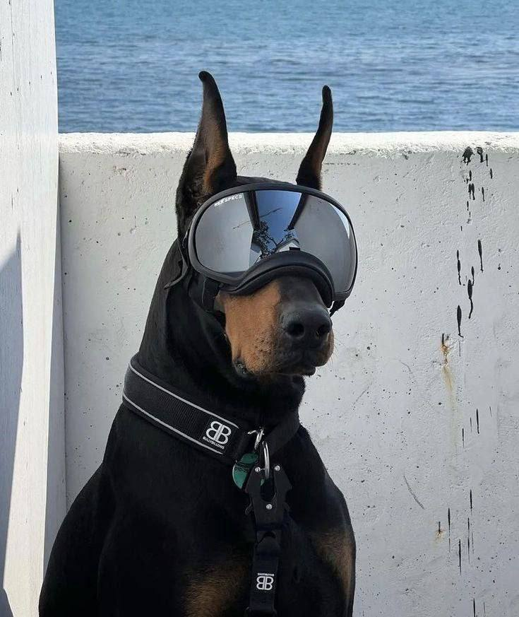
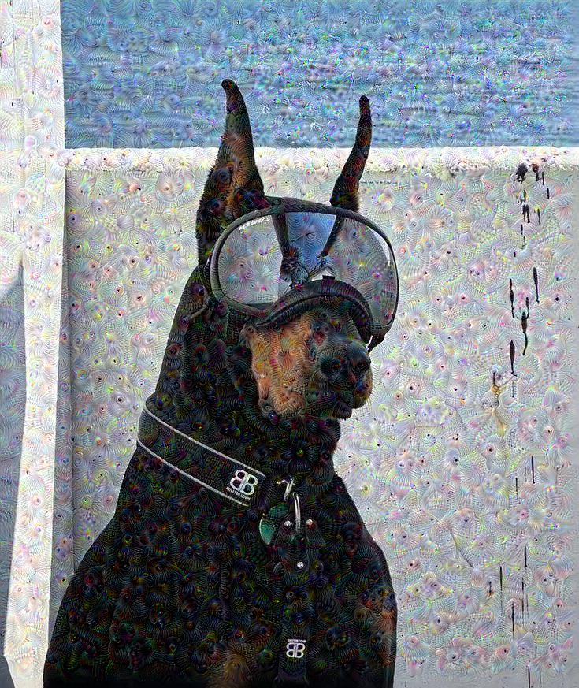
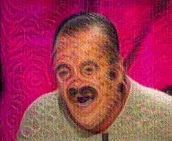

# DeepDream_for_Video_and_Photo

[en]
This project applies the DeepDream effect to each frame of a video or to a photo using the InceptionV3 model and TensorFlow.

[ru]
Этот проект применяет эффект DeepDream к каждому кадру видео с использованием модели InceptionV3 и TensorFlow.

## Examles
|  |  |
|------------------------------------|---------------------------------------------|
| Before                           | After                                   |

|  |  |
|----------------------------------|-----------------------------------------|
| Before                           | After                                   |

|  |  |
|------------------------------------|---------------------------------------|
| Before                             | After                                 |

## instructions / Инструкция

- [Русский (readme_ru.md)](readme_ru.md)
- [English (readme_en.md)](readme_en.md)
